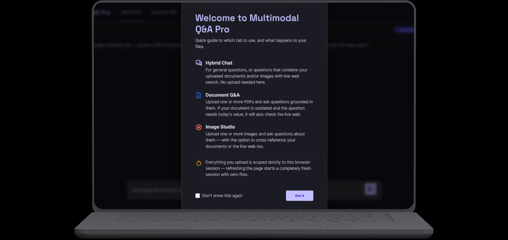
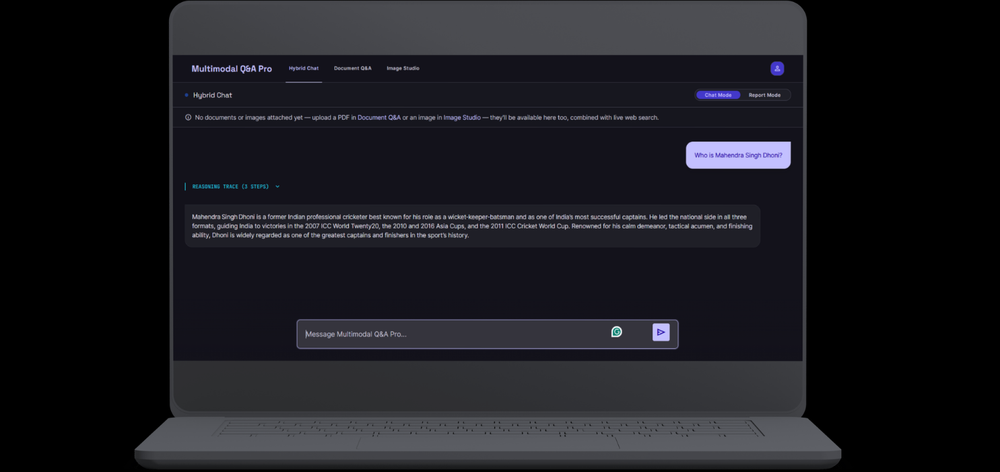
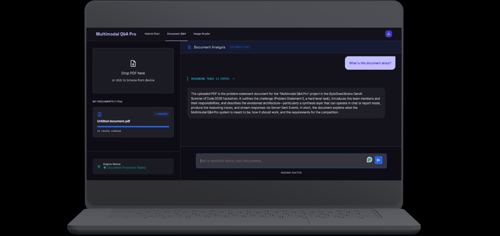
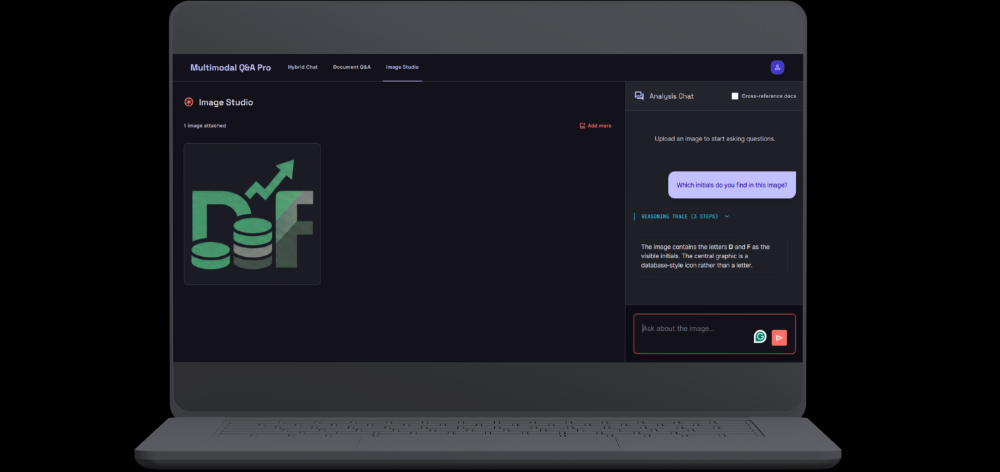

# Multimodal Q&A Pro — ByteSized Brains

GenAI Summer of Code · Hackathon 2026 · Problem Statement 5

An agentic Q&A assistant that reasons across **your uploaded documents**,
**live web search**, and **images** — and decides on its own which source(s)
a question actually needs, instead of always querying everything.

**🔗 Live deployment:** [dvmultimodal-qa.onrender.com](https://dvmultimodal-qa.onrender.com/)

> Hosted on Render's free tier — the instance spins down after periods of
> inactivity, so the first request after a while may take 30-60 seconds to
> wake it back up. Subsequent requests are fast.

## Demo

A full walkthrough video and screenshots of all four screens are in the
[`media/`](./media) folder.

#### Welcome Screen


#### Hybrid Chat


#### Document Q&A


#### Image Studio


📹 **Demo Video:** Watch the full recorded walkthrough [here](https://drive.google.com/file/d/1Es0QbsBfwaHBU6wuc1-i6Wz55Gz1Hs7m/view?usp=sharing).

## Team
- **Dhanya** — RAG pipeline, frontend/UI architecture, deployment operations
- **Vanshi** — Backend systems, agentic routing (LangGraph), LLM/synthesis logic

## What this is

A single [LangGraph](https://langchain-ai.github.io/langgraph/) `create_react_agent`
with three tools — `search_documents`, `search_web`, `describe_image` — driven
by an explicit routing prompt (not just implicit model judgment). The agent
decides which tools to call and in what order, then a synthesis layer turns
the run into either:

- **Chat Mode** — a natural conversational answer, or
- **Report Mode** — a structured, source-attributed investigation report
  (findings, cross-source conflicts, and a conclusion)

The live reasoning trace (which tools fired, in what order, and why) is
streamed back to the UI over SSE as the agent runs.

## How routing works

1. **Image uploaded this turn** → `describe_image` runs first; other tools
   (documents/web) only follow if the question needs cross-referencing.
2. **Document-first** → if a question could plausibly be answered from the
   user's uploaded PDFs, `search_documents` is always tried before
   `search_web`.
3. **Web is conditional, not automatic** → `search_web` only fires if
   `search_documents` comes back `NOT_FOUND_IN_DOCUMENTS`, or the question is
   explicitly about live/current information (today's news, live scores,
   current prices, etc.). The two tools are *not* called reflexively just
   because both are available.
4. **Explicit multi-source requests** → if the user explicitly asks to
   compare/check both documents and the web, both tools run even if one
   alone already answered the question.
5. Every claim in the final answer must trace back to a real tool result
   from that conversation — the agent is instructed never to state something
   as fact from a document or the web unless a tool actually returned it.

## Architecture

```
Custom UI (static/) → FastAPI (Uvicorn) → LangGraph create_react_agent
  (recursion_limit=25)
    ├─ search_documents  → ChromaDB (session-scoped retrieval, confidence-thresholded)
    │                       embeddings via HF Inference API (see note below)
    ├─ search_web        → DuckDuckGo search
    └─ describe_image    → Groq vision model (primary + fallback)
  → synthesis layer (Chat Mode or Report Mode)
  → answer + live reasoning trace streamed back over SSE
```

See `docs/architecture.md` for further detail as it's filled in.

### Document ingestion (RAG)

PDFs are parsed page-by-page (`pypdf`). Pages with little or no extractable
text (e.g. PPT-exported slide decks that are really just flattened images)
are rasterized (`PyMuPDF`) and OCR'd via the Groq vision model instead, so
image-only PDFs still work. Text is chunked
(`RecursiveCharacterTextSplitter`, chunk size 500 / overlap 100), embedded
with `sentence-transformers/all-MiniLM-L6-v2`, and stored in a local
ChromaDB collection with per-chunk `filename` + `page_number` metadata for
citations. Retrieval is filtered by a calibrated similarity threshold so
irrelevant chunks are reported as "not found" rather than forced into an
answer, and every query is scoped to the requesting session's own uploads.

**Note on embeddings — API-based, not local:** the embedding model
(`sentence-transformers/all-MiniLM-L6-v2`) is called through Hugging Face's
free serverless Inference API (`rag/hf_embeddings.py`) rather than loaded
locally via `sentence-transformers`/`torch`. This was changed after the
initial deployment attempt — `torch` alone adds 700MB-1GB+ to the container
and a comparable chunk of resident RAM, which exceeded the 512MB RAM ceiling
on free-tier hosts (Render, Fly.io) once real traffic came in. Moving the
embedding call out to HF's hosted inference keeps the exact same model and
retrieval quality, at the cost of a small network round-trip per
upload/query and being subject to HF's free-tier rate limits. Requires an
`HF_TOKEN` (free Hugging Face account, no card needed) — see **Secrets**
below.

### Vision

`describe_image` and the OCR path both go through one shared vision-call
helper (`agent/vision.py`), which tries a primary Groq vision model and
falls back to a secondary one on failure, so a single model outage doesn't
take down image Q&A or OCR ingestion.

## API

| Method | Path | Purpose |
|---|---|---|
| `POST` | `/api/chat` | Chat Mode: send a query, get a conversational answer |
| `POST` | `/api/chat/report` | Report Mode: send a query, get a structured JSON report |
| `POST` | `/api/upload/pdf` | Upload + ingest a PDF for the session |
| `GET` | `/api/upload/progress/{upload_id}` | SSE stream of real-time ingestion progress |
| `POST` | `/api/upload/image` | Upload an image for the session |
| `DELETE` | `/api/session/{session_id}` | End a session — deletes its documents and images |
| `GET` | `/api/stream/{session_id}` | SSE stream of the agent's live reasoning trace |

Sessions are in-memory (documents, images, and short conversation history),
scoped by a client-generated `session_id`, and cleared on session end or
server restart.

## Setup (local development)

1. `git clone "https://github.com/dhanyamankad/multimodal-qa.git"`
2. `cd multimodal-qa`
3. `python -m venv .venv && venv\Scripts\Activate`
4. `pip install -r requirements.txt`
5. Copy `.env.example` to `.env` and add your real `GROQ_API_KEY` and
   `HF_TOKEN` (free Hugging Face account → Settings → Access Tokens, "Read"
   scope, no card required)
6. `uvicorn main:app --reload --port 7860`
7. Open `http://localhost:7860`

### Running with Docker

```
docker build -t multimodal-qa .
docker run -p 7860:7860 --env-file .env multimodal-qa
```

## Tech stack

- **Backend:** FastAPI, Uvicorn
- **Agent orchestration:** LangGraph (`create_react_agent`), LangChain
- **LLMs:** Groq (`openai/gpt-oss-120b` for reasoning, Groq vision models for
  image understanding/OCR)
- **Retrieval:** ChromaDB, embeddings via HF Inference API
  (`sentence-transformers/all-MiniLM-L6-v2`, called remotely — see RAG note above)
- **PDF processing:** `pypdf`, `PyMuPDF`, `pdfplumber`
- **Web search:** DuckDuckGo (`ddgs`)
- **Frontend:** static HTML/CSS/JS (Tailwind), no build step

## Test scenarios covered

1. Pure document question → only `search_documents` fires
2. Image + doc cross-reference → `describe_image` → `search_documents` in order
3. Current-info question, no relevant docs → clean fallback to `search_web`
4. Simulated web search timeout → UI reports failure gracefully, no crash
5. Cold live Render URL → full query works, zero local setup (free-tier
   instance spins up from sleep on the first request)
6. Doc-only question → no unnecessary web search
7. No answer in docs, answerable on web → clean fallback
8. Outdated doc fact vs. current web fact → `conflicts` correctly populated
9. Multi-part question needing both sources → every claim attributed correctly

## Known limitations

- **ChromaDB is local/in-memory-backed** — it resets on container restart;
  there's no persistent vector store across deploys.
- **Sessions are in-memory** (documents, images, conversation history) — a
  server restart clears every active session.
- **Groq free-tier rate limits** apply to both the reasoning and vision
  models; heavy concurrent usage may hit them.
- **Vision model availability** is Groq-dependent — models get deprecated
  with little notice, so the primary/fallback pair in `agent/vision.py` may
  need to be swapped again in the future.
- **Web search** uses DuckDuckGo's unauthenticated search and can be flaky
  or rate-limited under load; failures degrade to a clear "unavailable"
  message rather than crashing.
- **Embeddings depend on HF Inference API availability** — since embeddings
  are no longer computed locally (see RAG note above), document upload and
  retrieval require outbound network access to
  `router.huggingface.co` and are subject to its free-tier rate limits and
  occasional cold-start delays (handled with retry/backoff in
  `rag/hf_embeddings.py`).

## Secrets

- `GROQ_API_KEY` — read via `os.environ.get("GROQ_API_KEY")`. Powers the
  reasoning model and vision (image understanding/OCR).
- `HF_TOKEN` — read via `os.environ.get("HF_TOKEN")` in
  `rag/hf_embeddings.py`. Free Hugging Face access token (Settings → Access
  Tokens, "Read" scope), used to call the embeddings model through HF's
  serverless Inference API instead of loading it locally (see RAG note
  above).

Locally both come from `.env` (gitignored, see `.env.example`). On Render,
both are set as environment variables in the service's **Environment** tab.
